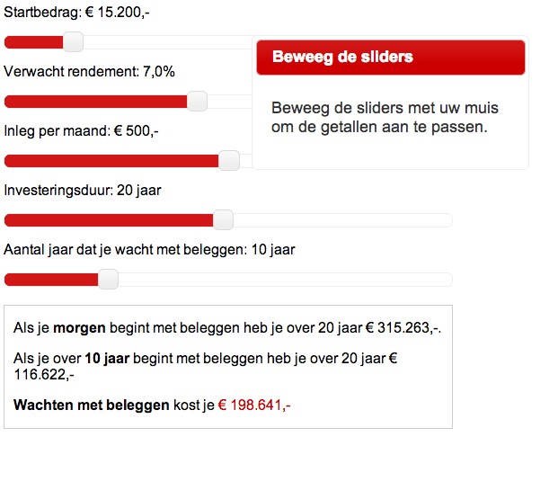
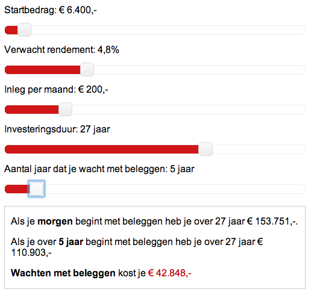

Deze tool helpt je om uit te rekenen wat je kunt verdienen op de beurs of op een spaarrekening.
Bekijk hoe de tool er uit kan zien: http://online-aandelenkopen.nl/gratis-beleggingstips/

## Todo:

    - lijkt wel of het cookie niet gezet wordt, kan door file:// komen
    - browser testing

## Implementatie

Download financial-tool.min.js uit de `build` directory.

    

    

        
Startbedrag: 

        

        
Verwacht rendement: 7,0%

        

        
Inleg per maand: &euro; 500,-

        

        
Investeringsduur: 20 jaar

        

        
Aantal jaar dat je wacht met beleggen: 10 jaar

        

        

        

Beweeg de sliders met uw muis om de getallen aan te passen.

        
<a href="http://online-aandelenkopen.nl/" title="Aandelen Kopen">Een tool van Online-Aandelen Kopen</a>

    

## Bouwen

- Installeer jsl (javascript linter)
- Installeer jsmin (javascript minifier)
- Clone het project

    git clone https://github.com/afjlambert/financial-tool.git

- Ga naar de project-root en draai

    ./build.sh

## Copyright

Deze tool is gratis om te gebruiken onder de Creative Commons Attribution-NoDerivs licentie.
Zie http://creativecommons.org/licenses/by-nd/3.0/